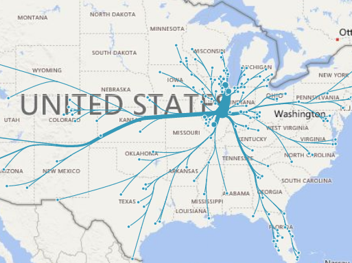

## Backgound

Flow maps are a special type of network visualization for object movements, such as the number of peopele in a migration. A typical flow map, which contains one source and multiple targets, is visualized as a flow-style tree overlaied on top of a map. 

The line thicknesses are scaled to represent the values between the source (the root) and the targets (the leaves). By merging edges together, Flow maps can reduce visual clutter and enhance directional trends. 

## How to Use
* Required fields: 
    * **Origin location/label** and **Destination location/label**: These two fields are used to construct relationships. They are also used to query geo-locations if latitude/longitude are not specified.
    * **Value**: This field is used to compute flow widths. Negative values will be ignored. 
* Optional fields:
    * **Category**: If specified, the flows that have the same category value will be colored the same.
    * **Origin/Destination latitude/longitude**: These fields specify the geo-locations of sources and targets. 

* Special settings:
    * **Flow type**: It can be either `Out-flow`, which constructs flows based on the origins, or `In-flow`, which constructs flows based on the destinations.
    * **Flow limit**: This controls the max number of flows that can be displayed simultaneously.
* Need more help? Please leave a comment below.

***

